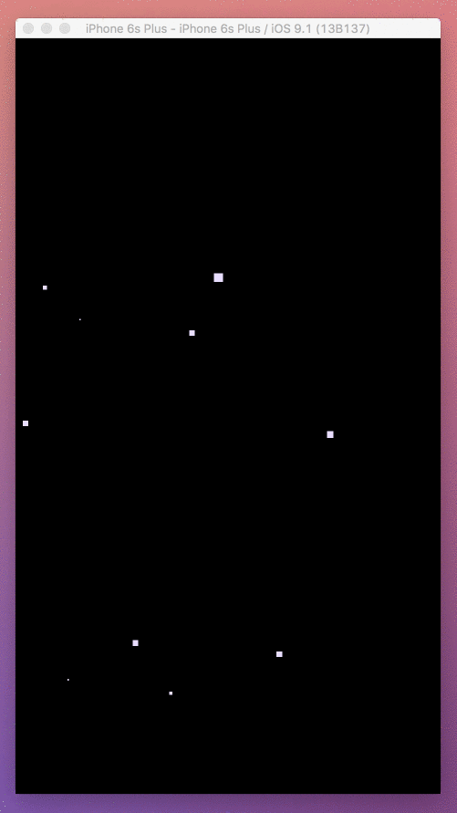
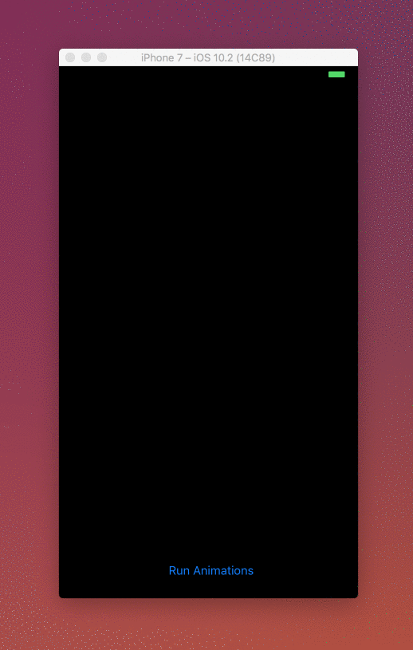

# Effects

A `CoreGraphics` and `CoreAnimation` experiment. Much of this is WIP.

To use one of the custom `UIView` subclasses, simply add a `UIView` to a Storyboard scene and set the `UIView`'s class in the Identity Inspector. Set the `IBInspectable` properties and enjoy! 

You can also create one and add it to the view heirarchy manually:

```
let starfieldView = StarfieldView(frame: self.view.frame)
starfieldView.starColor = UIColor.whiteColor()
starfieldView.canvasColor = UIColor.blackColor()
view.addSubview(starfieldView)
```

Here's what `StarfieldView` looks like:




`LaserShowView` looks like this:



- Animations can now be controlled via a protocol method. Fire the animations whenever you want. 
- Lasers are randomly positioned throughout the view's frame between each run of the animations.
- Implicit animations are disabled now (unlike the `StarfieldView`).
- Control the pace of the lasers using the `laserLengthLagTime`.
- Enjoy!

